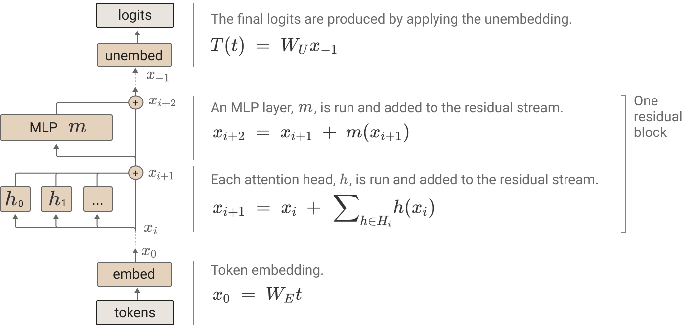
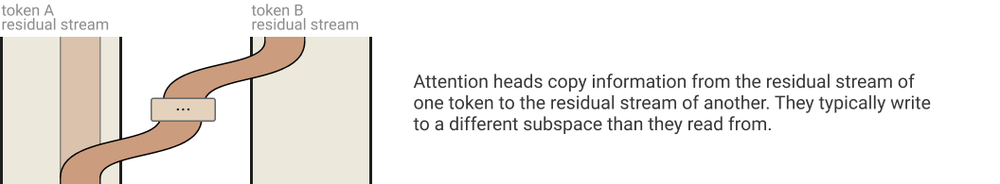
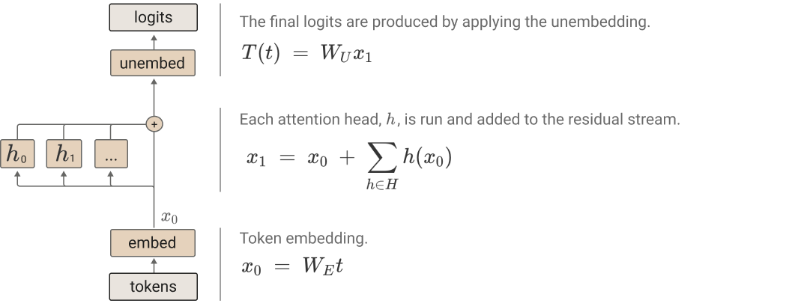
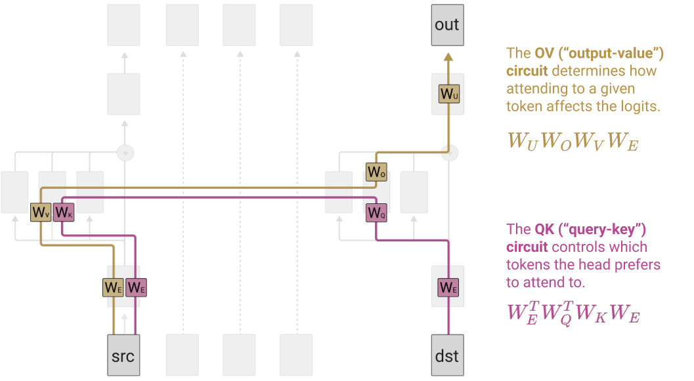

+++
date = '2026-08-30T21:13:22+08:00'
draft = false
math = true
title = 'QK/OV Circuits and How To Find Them'
+++

## Transformer Overview
At a high-level, the transformer architecture is as follows:

It contains one or more transformer blocks (composed of attention layers and an MLP layer) along with embedding and unembedding layers.

An attention layer comprises $H$ attention heads and each head computes an output $r^{h_i} \in \mathbb{R}^{d_{head}}$. These head outputs are concatenated and passed through the attention layer's output projection matrix $W_O$. We can equivanlently partition $W_O$ into one block $W^{h_i}_O \in \mathbb{R}^{d_{model} \times d_{head}}$:

$$
\begin{aligned}
W_O \mathrm{Concat}(\mathbf{r}^{h_1},\; \mathbf{r}^{h_2},\; \dots)
&=
\begin{bmatrix}
    W_O^{h_1} & W_O^{h_2} & \cdots
\end{bmatrix}
\begin{bmatrix}
    \mathbf{r}^{h_1} \\
    \mathbf{r}^{h_2} \\
    \vdots
\end{bmatrix} \\
&=
\sum_i W_O^{h_i}\mathbf{r}^{h_i}.
\end{aligned}
$$

This representation makes two properties explicit: each head producies its own contribution $W^{h_i}_O r^{h_i}$ independently of the other heads, and these contributions combine additively to form the output of the attention layer.

# Attention

Attention is commonly given as

$$
\begin{gathered}
Q = XW_Q, \quad K = XW_K, \quad V = XW_V \\
A = \operatorname{softmax}\left(\frac{QK^T}{\sqrt{d_K}}\right) \\
\operatorname{Attention}(X) = AVW_O
\end{gathered}
$$

But a non-standard, but informative representation of attention is given as

$$
\begin{aligned}
h(x) &= (Id \otimes W_O) \cdot (A \otimes Id) \cdot (Id \otimes W_V) \cdot x \\
     &= (Id \cdot A \cdot Id \otimes W_O \cdot Id \cdot W_V) \cdot x \\
     &= (A \otimes W_O W_V) \cdot x
\end{aligned}
$$

where $h(x)$ is the output of a single attention head after its output projection and before the MLP.

We can also compute attention scores in one step

$$
A = \operatorname{softmax}\left(x^T W^T_Q W_K x \right)
$$

While this is mathematically equivalent, multiplying by $W_O W_V$ and $W^T_Q W_K$ is computationally inefficient. However, it does provide better intuition for the internal structure of attention heads.

# Residual Stream

We have seen that attention heads contribute independently to the residual stream, but individual heads can be decomposed further. It helps to imagine each token position having its own residual-stream vector

$$
x_t \in  \mathbb{R}^{d_{model}}
$$

Although each token has its own residual stream, these vectors are all represented in the same $d_{model}$-dimensional vector space. An attention head can "read" information from the residual streams of source tokens and "write" a resulting contribution into the residual stream of a destination token. Attention therefore allows information to move between token positions, while residual connections carry and accumulate these representations through successive layers.

For a single attention head, the update to destination token $d$ can be viewed as

$$
\Delta x_d = \sum_{s \le d}{(A_{ds} W_O W_V x_s)}
$$

where each previous source token $s$ contributes some transformed information to the destination according to its attention weight $A_{ds}$.

Two new terms:

- Destination token: token whose residual stream is being updated.
- Source token: token whose residual stream provides information for the update.

# One-Layer Model

Before looking at deeper transformers, it is useful to start with the simplest setting where these ideas become explicit: a one-layer, attention-only transformer. In this case, the model can be decomposed end-to-end into a direct path from embeddings to logits and a set of paths through individual attention heads. This makes the contribution of each head easier to isolate and provides a clean setting for introducing QK and OV circuits.

For a one-layer attention-only transformer, the entire computation from token embeddings to output logits can be written as
$$
T = (Id \otimes W_U) \cdot (Id + \sum_{h \in H_1}{A^h \otimes W^h_{OV}}) \cdot (Id \otimes W_E)
$$

where $H_1$ is the set of attention heads in the layer, $A^h$ is the attention pattern of head $h$, and $W^h_{OV} = W^h_O W^h_V$.

The useful trick is to expand this product. Because the residual connection contributes the identity term, the computation separates into a path that bypasses every attention head and a collection of paths that each pass through one head.

$$
\begin{aligned}
T &= (Id \otimes W_U) \cdot (Id + \sum_{h \in H_1}{A^h \otimes W^h_{OV}}) \cdot (Id \otimes W_E) \\
&= (Id \otimes W_U) \space Id \space (Id \otimes W_E) + (Id \otimes W_U) (\sum_{h \in H_1}{A^h \otimes W^h_O W^h_V}) (Id \otimes W_E) \\
  &= \underbrace{
    Id \otimes
    \vphantom{\displaystyle \sum_{h \in H_1}
    A^h \otimes W_U W^h_O W^h_V W_E}
    W_U W_E
}_{\text{direct path}}
+
\underbrace{
    \sum_{h \in H_1}
    A^h \otimes W_U W^h_O W^h_V W_E
}_{\text{sum of all head paths}}
\end{aligned}
$$

The first term is the direct path: information travels from the token embedding directly through the residual stream to the unembedding. Each summand in the second term is an end-to-end path through a single attention head. The model's output can therefore be understood as the additive contribution of the direct path and all individual head paths.

# QK and OV Circuits

So far, we have looked at how attention heads interact via the residual stream and how information can accumulate across transformer blocks, but now we can inspect individual attention heads. Notice that there are two distinct operations occurring within an attention head: where to read information from, and what information to move.

For each attention head $h$, we have

$$
A^h \otimes (W_U W^h_{OV} W_E)
$$

where $A^h = \operatorname{softmax}(x^T W^T_E W^h_{QK} W_E x)$ and softmax here involves causal masking.

First is the Query-Key (QK) Circuit. It computes a collection of attention weight vectors that form an attention matrix $A^h$. Intuitively, it tells the head at the current destination token position which previous source tokens in the sequence to attend to or "read" from.

$$
\operatorname{QK}(x_d, x_s) = x^T_d \space W_{QK} \space x_s
$$

The QK circuit can be thought of as a bilinear function of the destination and source residual-stream vectors, equivalently the interaction between the destination token's query vector and the source token's key vector.

Second is the Ouput-Value (OV) Circuit. It determines how information from an attended source token affects the output logits.

$$
\operatorname{OV}(x_s) = W_{OV} \space x_s
$$

The OV circuit is a linear function mapping a source token's residual-stream vector to a residual-space contribution that can be added to the destination token's residual stream.
