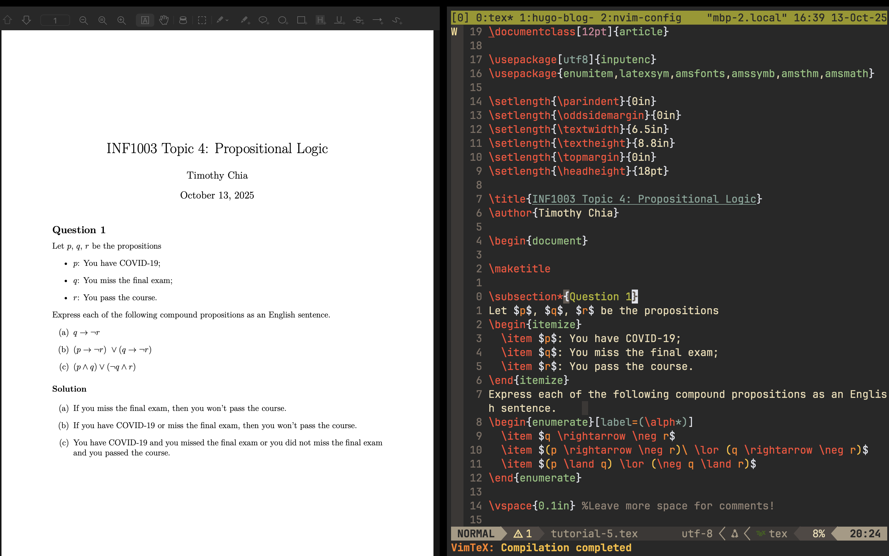

+++
date = '2025-10-13T13:15:40+08:00'
title = 'Writing LaTeX in Neovim on MacOS'
+++

## Background

As a university student in the field of computer science, my workflow largely revolves around note-taking, programming, and writing math equations. I heavily rely on Neovim and its plugins as my primary development environment due to its versatility and efficiency. 

Currently, I write my math notes and tutorials on an iPad, but I would prefer documents that look more professional. After some googling I discovered LaTeX and it's superior formatting and ability to handle equations. However, one gap in my workflow was handing LaTeX documents directly within Neovim without switching to external software.

There isn't much documentation about this topic online. So I'll be walking through the steps I took to enable LaTeX within Neovim and integrate document previewing. I hope this guide helps anyone facing the same challenges I did. :D

## Overview

First, the plugin I will be installing is [VimTeX](https://github.com/lervag/vimtex). It is a Vim/Neovim plugin that provides a comprehensive suite of tools for editing and compiling LaTeX documents. Then, we install [Tectonic](https://github.com/tectonic-typesetting/tectonic?tab=readme-ov-file) which compile `.tex` files into `.pdf` documents. Lastly, I need a way to preview our PDF documents and [Skim](https://skim-app.sourceforge.io/)  will be used for that.

## Prerequisites

Before continuing, ensure the following requirements are met:
- **Homebrew** installed
- **Neovim** installed and set up    
    - Requires version **0.10 or later**
- **Lazy.nvim** plugin manager installed and configured

## Folder Structure

This is what my `nvim` config folder structure looks like:

```
.config/ 
└── nvim/ 
    ├── init.lua 
    └── lua/ 
        ├── settings.lua
        └── plugins/
            └── ...
```

My actual configurations can be found on [GitHub](https://github.com/timothyckl/configs/tree/main) for reference as well.

## Steps

### Install VimTeX

In `.config/nvim/lua/plugins/`, create a `vimtex.lua` file that returns the following table:

```
return {
  "lervag/vimtex",
  lazy = false,     -- we don't want to lazy load VimTeX
  -- tag = "v2.15", -- uncomment to pin to a specific release
  init = function()
    -- VimTeX configuration goes here, e.g.
    vim.g.vimtex_view_method = "zathura"
  end
}
```

**Note**: These are default settings from VimTeX's install guide. For a full list of configurations, visit their README's [configuration](https://github.com/lervag/vimtex?tab=readme-ov-file#configuration) section.

We’ll use Tectonic as the LaTeX engine and Skim as the PDF viewer. After installing them, we’ll update our Lua config so VimTeX uses these instead of the defaults.

### Install Tectonic

Tectonic is a modernised TeX/LaTeX engine. While it offers many other features, the scope of this guide only covers compilation of `.tex` to `.pdf` documents.

Installation is as simple as a single `brew install` command:

```
brew install tectonic
```

Next, let's verify our installation by checking its version:

```
tectonic --version
```

### Install Skim

I’m using Skim instead of macOS Preview while drafting because Preview jumps back to the first page on every LaTeX compile, whereas Skim keeps my place, which is ahuge time-saver on lengthy PDFs.


We can also install this with `brew install`:

```
brew install skim 
```

Next, we'll need to configure extra settings by launching Skim, then going to Settings > Sync > PDF Text Support, enter the following:

**Command**: `nvim` \
**Arguments**: `--headless -c "VimtexInverseSearch &l '%f'"`

### Putting Everything Together

Going back to `vimtex.lua`, revise the previous configuration to mirror the following:

```
return {
    "lervag/vimtex",
	lazy = false,
	init = function()
		vim.cmd("filetype plugin indent on")
		vim.cmd("syntax enable")

		vim.g.vimtex_view_method = "skim"
		vim.g.vimtex_compiler_method = "tectonic"
		vim.g.vimtex_quickfix_open_on_warning = 0
	end,
}
```

Remember to set `vim.g.map.localleader` in `init.lua` to a keybind of your choice (I use the backslash `\` character). 

## Result




To see a full list of keybinds, use `:help vimtex-default-mappings` within `nvim`.

My go-to VimTeX keybinds:
- `\ll` — Compile (continuous)
- `\lk` — Stop compiler
- `\lc` — Clean aux files
- `\li` — Info (VimTeX status)
- `\lv` — View PDF
- `\lo` — Open log/quickfix
- `\le` — Errors (jump to first)

## Conclusion 

With VimTeX, Tectonic, and Skim working together, I can draft, compile, and preview polished LaTeX documents without ever leaving Neovim—and that’s been a huge upgrade from handwriting notes on the iPad. This setup is fast, reproducible, and scales nicely from quick homework write-ups to longer reports.

And if you hit any snags, :help vimtex is excellent, plus the VimTeX README has answers to most questions. Additionally, my favourite resource for document templates in LaTeX is Overleaf’s [template gallery](https://www.overleaf.com/latex/templates). Happy TeX’ing!
